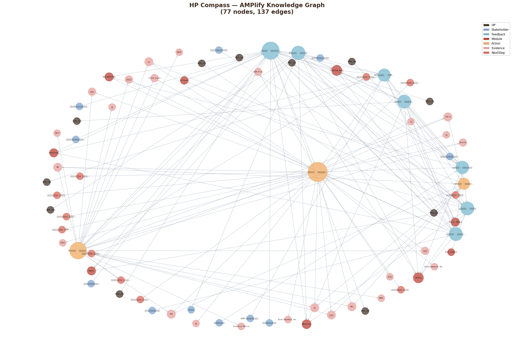

# AMPlify Human Practices — HP Compass

## 概述

> We developed HP Compass to prevent Human Practices from becoming a collection of disconnected interviews. The model organizes stakeholders, feedback, project actions, evidence, and loop status into a decision-support knowledge graph. Through this model, AMPlify can show how stakeholder feedback changed our model design, wet-lab validation, software reports, safety boundaries, implementation scenarios, and education strategy.

HP Compass 不是为了给 HP 打分，而是为了回答一个更重要的问题：
**谁改变了 AMPlify，改变了哪里，我们是否已经用行动和证据回应了这些反馈。**

我们完成了 **11** 轮 Human Practices，覆盖了 **9** 个项目模块，当前所有反馈循环均处于 L3（有证据）阶段，下一步将推进二轮专家反馈（L4）。

---

## Stakeholder → Feedback → Action 知识图谱

---

## HP 影响力时间线

### 2026-01-24 — 西北农林科技大学西安动物医院的临床医生与院长（兽医临床 stakeholder）

#### 🔍 反馈核心

是：动物医疗不能被简单概括为“治疗细菌感染”。宠物、经济动物、皮肤、肠道、泌尿生殖系统、呼吸道和耳道对应不同临床逻辑。抗菌肽如果未来要进入真实世界，必须先被放入具体场景，并清楚说明它是治疗、辅助、预防，还是候选筛选工具。
Human Practices 摘要卡片
从宠物治疗设想到动物健康应用场景
我们联系了谁：
西北农林科技大学西安动物医院的临床医生与院长
动物医院检验中心工作人员
为什么：
项目早期，我们想确认宠物细菌感染是否适合作为 AI 设计抗菌肽的第一个应用场景。
我们希望了解常见病原、治疗周期、耐药性、治疗费用，以及抗菌肽可能以何种形式进入真实动物医疗。
我们学到了什么：
动物感染不能被笼统写成“所有细菌感染”。不同系统对应不同病原、诊断方式和给药路径。
宠物临床已有换药、联合用药、外用清洗、口服抗生素等成熟策略；抗菌肽在宠物市场中可能更像辅助或保健产品。
皮肤、耳道等体表局部场景比广泛体内感染更现实；经济动物的减抗、无抗和残留控制可能具有更高价值。

#### 📂 影响模块

- Problem Definition
- Implementation
- Safety
- Model
- Software

#### 🔧 项目修改

- 我们不再把 AMPlify 简单定位为“宠物抗菌药”，而是转向动物健康、抗生素减量和 One Health 的候选肽评估框架。
- 我们保留皮肤/耳道局部使用作为可讨论场景，同时把畜禽、泌乳期、蛋鸡和养殖端减抗纳入后续调研方向。
- 我们在后续模型和软件叙事中加入“应用场景、给药路径、证据等级和安全边界”等字段。

#### 📖 故事主线位置

此轮 HP 将 AMPlify 从 *应用场景探索* 推进到 *真实场景中的疾病靶向设计*。

---

### 2026-03-09 — 西北农林科技大学家畜生物学重点实验室刘军教授（动物健康 / 家畜专家）

#### 🔍 反馈核心

直接改变了我们的 Model、Software、Wet Lab 解释和 Implementation 边界。
因此，这一轮 HP 的价值是“找到一个应用场景”，并且把利益相关者对疗效、安全性、成本、递送和监管的判断转化为可进入模型评分和软件报告的指标。后续我们将把 revised Field Score、候选肽报告和风险边界返回给专家或养殖端，完成第二轮反馈。
Human Practices 摘要卡片
从乳腺炎应用场景到耐药菌设计目标
我们联系了谁：
西北农林科技大学家畜生物学重点实验室刘军教授。
讨论主题包括羊/牛乳腺炎、养殖端减抗、抗菌肽设计、给药方式、生产成本和安全评价。
为什么：
我们希望判断羊/牛乳腺炎是否适合作为 AI 设计抗菌肽的核心应用，并了解养殖端真正关心的疗效、成本、给药和残留问题。
我们学到了什么：
乳腺炎在奶羊和奶牛中常见，病原组成受地区、场区环境、卧床清洁、挤奶流程和药浴消毒影响；杨凌附近羊群临床型乳腺炎约 5%–10%，隐性/亚临床乳腺炎可达 20%–30%。
刘军教授建议将科学问题提升为：设计能高效杀伤耐药菌、同时低真核细胞毒性的抗菌肽来解决细菌耐药性问题。
抗菌肽的关键障碍不只是活性，还包括细胞毒性、递送路径、乳汁/消化环境稳定性、生产成本、残留与监管边界。

#### 📂 影响模块

- Safety
- Model
- Implementation
- Material
- Problem Definition

#### 🔧 项目修改

- 将乳腺炎从“唯一目标疾病”调整为养殖端减抗和耐药压力的代表场景，把 AMPlify 主线转向耐药菌筛选、活性-安全窗口和证据分级报告。
- 在 Model/Software 中加入场景适配、毒性窗口、递送可行性、生产可行性和风险边界标签，让候选肽排序不只由预测活性决定。
- 在后续实验叙事中强调 MIC、溶血、CCK-8、TEM、MD 与理化性质共同支持候选肽评估，并明确当前仍是体外和模型层面的候选筛选。

#### 📖 故事主线位置

此轮 HP 将 AMPlify 从 *候选肽设计* 推进到 *证据链闭合的候选评估框架*。

---

### 2026-03-15 — 赵天意老师（AI / 生物大数据专家）

#### 🔍 反馈核心

非常直接：项目核心方向可以成立，但必须补上判别器、训练策略、数据清洗、结构/膜验证和实验验证这几块证据。正是这些质询，把 AMPlify 从“生成一些候选序列”推进为现在的 TAM-Flow 框架：以 ESM-2 + LoRA 作为编码基础，以 DiT-Rectified Flow 生成候选 latent，以 Oracle 专家模型和 RAFT 奖励过滤降低无效候选比例，再通过理化性质、MD 和湿实验验证闭合证据链。
因此，这不是一次普通的背景访谈，而是 AMPlify 早期最关键的技术校准之一。它帮助我们把后续干实验和湿实验组织成同一条故事线：模型负责提出可被解释和排序的候选，实验负责检验这些候选是否真正具有抗菌活性和可接受的安全窗口。
Human Practices 摘要卡片
From a generic generator to an evidence-bounded AMP design model
我们联系了谁：赵天意老师，生物大数据相关方向教师。访谈发生在 AMPlify 早期模型设计阶段，主题集中在生成式抗菌肽模型、判别器、训练数据和后续验证链。
为什么：当时我们已经能基于 ESM-2 生成候选肽，并计划合成少量序列，但仍需要确认：这些序列是否真的具有抗菌靶向性，模型是否被数据噪声误导，有限经费下如何提高命中率。
我们学到了什么：赵老师指出，只有生成器是不够的。项目必须建立能判断抗菌潜力、毒性和关键性质的判别器；不能把大量无关蛋白序列直接混入抗菌肽微调；少量合成候选面临很高失败风险；结构和膜相互作用分析应作为筛选依据。

#### 📂 影响模块

- Safety
- Model
- Material
- Social Media
- Problem Definition

#### 🔧 项目修改

- 我们将早期 ESM-2 微调思路发展为 TAM-Flow：ESM-2 + LoRA 编码、DiT-Rectified Flow 生成、Oracle 专家模型评分和 RAFT 奖励过滤；同时加入理化性质、MD、合成质谱、MIC、溶血、CCK-8 和 TEM，形成从预测到实测的证据链。

#### 📖 故事主线位置

此轮 HP 将 AMPlify 从 *候选肽设计* 推进到 *证据链闭合的候选评估框架*。

---

### 2026-03-20 — 西北农林科技大学罗自卫老师（湿实验 / 合成生物学专家）

#### 🔍 反馈核心

直接影响 AMPlify 的 Wet Lab、Engineering、Model 和 Software：候选肽不再只是按模型分数排序，而要在报告中显示已测证据、机制支持、毒性边界和生产可行性。它让我们的 HP 主线从“真实需求是什么”继续走向“什么证据可以支撑我们的设计”。
Human Practices 摘要卡片
从 AI 候选序列到可验证的湿实验证据链
我们联系了谁：
西北农林科技大学罗自卫老师。
为什么：
我们需要确定AI 生成的抗菌肽怎样被湿实验可信地验证，哪些证据足以支持候选肽进入软件报告和 Wiki 叙事。
我们学到了什么：
抗菌对象必须和应用场景对应，不能只测试方便获得的菌株；同时应覆盖革兰氏阳性菌和阴性菌，并设置已报道高活性抗菌肽或抗生素作为强对照。
MIC、溶血、细胞毒性、表达量、纯化结果和产物鉴定需要构成一条完善的湿实验证据链。
生产体系可以与功能验证并行推进：先用化学合成肽验证活性，再用大肠杆菌、毕赤酵母或枯草芽孢杆菌等底盘探索表达与纯化可行性。

#### 📂 影响模块

- Safety
- Model
- Material
- Problem Definition
- Software

#### 🔧 项目修改

- 将湿实验路线调整为“模型筛选 -> 化学合成 -> MIC 活性验证 -> 溶血/CCK-8 安全性验证 -> TEM/机制支持 -> 表达与纯化可行性”。
- 最终不盲目追求几十条序列，而是从模型输出和候选库中筛选 7 条代表性候选肽进入实验验证，并在报告中解释筛选依据和证据边界。
- 在 Software 报告中加入 Evidence Level 和 Production Feasibility 标签，区分实测数据、模型推断、文献支持和未来验证。

#### 📖 故事主线位置

此轮 HP 将 AMPlify 从 *候选肽设计* 推进到 *证据链闭合的候选评估框架*。

---

### 2026-04-18 — 哈尔滨工业大学生命科学与医学学部聂桓老师（iGEM / Wiki 交流 stakeholder）

#### 🔍 反馈核心

提醒我们，项目质量还取决于能否共享资源、总结失败经验，并把生物学问题写成可交流、可理解的工程化系统。
因此，这一站在 HP 主线中的作用是把 AMPlify 从“本队内部验证”推向“跨校协作与外部视角”。它提醒我们：项目需要被其他团队看懂，叙事需要经得起外部提问，工程化目标也需要用更清晰的语言表达。
Human Practices 摘要卡片
从单队项目到跨校交流
我们联系了谁：
哈尔滨工业大学生命科学与医学学部聂桓老师。
为什么：
我们需要判断项目如何在跨校交流中被更清楚地讲述。
我们学到了什么：
iGEM 是跨学科、跨校际的交流平台。真正有价值的合作应共享不可复制的资源、失败经验和项目建设思路，而不是停留在表面交流。

#### 📂 影响模块

- Material
- Social Media
- Safety
- Problem Definition

#### 🔧 项目修改

- 我们把“跨校交流与外部视角”加入 HP 主线：在介绍 AMPlify 时，不只展示候选肽和实验结果，也说明项目的工程化目标、合作价值和证据边界。
- 故事主线

#### 📖 故事主线位置

此轮 HP 将 AMPlify 从 *安全边界与生态评估* 推进到 *使用边界与生态降解评估体系*。

---

### 2026-04-19 — 西安市浮生闲猫咪驿站工作人员（公众教育 stakeholder）

#### 🔍 反馈核心

宠物猫并不是频繁使用抗生素的对象，但不当用药、过量用药、反复皮肤病和局部感染仍可能造成治疗困难。实际场景中，问题常常不是“用不用抗生素”这么简单，而是诊断、剂量、联合用药和主人认知共同决定结果。

#### 📂 影响模块

- Education
- Problem Definition
- Safety
- Implementation

#### 🔧 项目修改

- 我们把宠物端写成 AMPlify 主线中的“日常照护与用药认知”层：它帮助我们解释为什么抗菌药物替代方案必须谨慎、可解释，并明确边界；同时也说明项目主要验证场景仍应聚焦更高风险、更可控的动物感染问题。
- 故事主线：宠物端的问题为什么仍然重要？
- 在最初的项目讨论中，宠物感染似乎是一个很直观的入口：猫狗与人类距离近，主人对治疗效果也敏感。但随着我们访问宠物医院和一线照护者，问题变得更加复杂了。工作人员指出，猫并不是抗生素使用最频繁的动物；病毒感染、皮肤问题和耳部问题往往会先通过护理、消毒、消炎、外用药或联合方案处理。也就是说，宠物端并不能被简单写成“抗生素大量使用”的场景。
- 然而，这并不意味着宠物端与 AMPlify 无关。恰恰相反，这一站让我们看到另一种风险：当疾病反复、诊断不清或主人自行用药时，治疗会变得混乱。工作人员提到，皮肤病可能因为反复使用抗菌药物而越来越难处理；耳部局部感染也常常需要根据具体病原体调整方案。对 AMPlify 来说，这说明真实世界中的抗菌方案必须能被解释、被限制，并且不能鼓励非专业人员自行使用。

#### 📖 故事主线位置

此轮 HP 将 AMPlify 从 *应用场景探索* 推进到 *真实场景中的疾病靶向设计*。

---

### 2026-04-20 — 杨陵揉谷镇除张村羊场人员张伟（养殖端 stakeholder）

#### 🔍 反馈核心

羊场以预防为主。乳房炎频率不高但损失明显，混合感染风险使一线更重视广谱、低损伤、给药便利性和成本可控性。

#### 📂 影响模块

- Implementation
- Problem Definition
- Safety
- Education

#### 🔧 项目修改

- 主线从“设计候选抗菌肽”推进为“候选肽必须面对真实养殖约束”。
- 故事主线：为什么羊场是项目转向的关键一站？
- 前几轮 HP 帮助 AMPlify 逐步校正问题：宠物端让我们看到日常照护和公众认知的复杂性，实验室访谈让我们意识到候选肽必须有证据链支撑；而羊场调研则把项目带入了一个更清晰的应用背景。这里的感染问题不只关乎一只动物是否治好，还关乎泌乳能力、羊奶检测、停奶期、群体防控和养殖户是否愿意承担新技术风险。
- 张伟的反馈让我们认识到，养殖端并不会因为一个技术概念新颖就接受它。一线人员首先关心的是能否真正有效、是否影响羊体健康和羊奶质量、能否降低治疗和人工成本、是否适合群体化管理。他更倾向广谱型抗菌肽，因为羊群可能同时暴露于多种病原，实际养殖中也很难每次先完成专业病原检测再选择特异性产品。

#### 📖 故事主线位置

此轮 HP 将 AMPlify 从 *应用场景探索* 推进到 *真实场景中的疾病靶向设计*。

---

### 2026-04-22 — 武功县诚威奶山羊羊场负责人杜欣愿（养殖端 stakeholder）

#### 🔍 反馈核心

，乳房炎年发病率约 10%，其中慢性乳房炎更常见，治疗后常出现泌乳量下降、硬块、萎缩和复发；急性或败血性乳房炎虽少见，但常与金黄色葡萄球菌、厌氧菌等病原相关，一旦出现乳房发紫、发黑或坏死，临床利用价值往往迅速丧失。
因此，这次调研帮助 AMPlify 把项目主线从“候选抗菌肽能否抗菌”推进到“候选抗菌肽是否能回应奶山羊乳房炎的真实治疗约束”。在这一语境下，广谱性、免病原鉴定、肌肉注射与乳房灌注的适配、疗效可重复验证，以及治愈后泌乳恢复和复发情况，成为比理论机制更重要的一线评价标准。
Human Practices 摘要卡片
从真实病种走向产品约束：把乳房炎写成主线核心场景
我们联系了谁：
武功县诚威奶山羊羊场负责人杜欣愿。羊场约 290 只奶山羊，品种以萨能和阿尔卑斯奶山羊为主，采用全圈养管理。
为什么：
这一站进一步聚焦到奶山羊乳房炎本身，明确项目真正要回应的疾病痛点。
我们学到了什么：
乳房炎年发病率约 10%，慢性型易复发并造成泌乳下降；败血性乳房炎危害更大。现有治疗周期长、成本高、复发率高。

#### 📂 影响模块

- Problem Definition
- Implementation

#### 🔧 项目修改

- 我们如何修改项目：
- 进一步了解了真实养殖端对候选肽约束。 它明确了信任建立方式：养殖户更相信 2-4 只患病羊治疗方案的真实验证和口碑扩散，而不是单纯的理论宣传。

#### 📖 故事主线位置

此轮 HP 将 AMPlify 从 *应用场景探索* 推进到 *真实场景中的疾病靶向设计*。

---

### 2026-05-01 — 基层执业兽医与散养户（养殖端 stakeholder）

#### 🔍 反馈核心

散养户重视疫苗、通风和预防；他们认可乳腺炎根源是细菌感染，但对抗菌肽这类“高科技”方案保持审慎。

#### 📂 影响模块

- Implementation
- Safety
- Problem Definition

#### 🔧 项目修改

- 主线加入“基层可理解性”和“实验验证边界”：不能把抗菌肽说成万能替代品。
- 故事主线：为什么散养户让项目更谨慎？
- 如果说 4 月 20 日的羊场调研让 AMPlify 看到生产动物场景中的经济压力、给药便利性和食品安全约束，那么 5 月 1 日的散养户访谈则进一步提醒我们：一线基层并不会因为一个技术概念新颖就自然接受它。一线养殖者首先关心的是能不能解决问题、会不会带来风险、是否会影响产奶和羊群健康，以及这个方案与疫苗、抗生素和日常预防之间到底是什么关系。
- 当我们介绍抗菌肽时，受访者提出了质疑：如果这类方案真的足够有效，是否意味着疫苗都不需要了？这个问题迫使我们重新审视表达方式。AMPlify 不能把抗菌肽叙述为替代所有防控手段的产品，而应把它放在明确适应场景和实验验证的边界内：它是针对细菌感染问题的候选抗菌策略，不是对所有传染病治疗方案、疫苗或养殖管理的替代。
- 同时，访谈也确认了项目靶点的现实基础。受访者认为，母羊乳腺炎的最终根源仍然与细菌感染相关：外界挤压或伤口可能只是入口，真正导致感染的是细菌进入乳腺组织。这一判断支持了 AMPlify 继续围绕抗菌机制构建项目故事，但也要求我们把“机制合理”与“真实有效”区分开来。前者是项目成立的逻辑起点，后者必须由实验和更严格的验证来证明。

#### 📖 故事主线位置

此轮 HP 将 AMPlify 从 *应用场景探索* 推进到 *真实场景中的疾病靶向设计*。

---

### 2026-05-02 — iGEM 东北地区交流会参会队伍与经验分享者（iGEM / Wiki 交流 stakeholder）

#### 🔍 反馈核心

交流会提醒我们，高质量 HP 不取决于活动数量，而取决于能否说明 Stakeholder → Feedback → Action → Impact；Education 也不应堆数量，而要让受众真正理解问题；Wiki、海报和答辩需要共享同一条逻辑。

#### 📂 影响模块

- Problem Definition
- Social Media
- Education

#### 🔧 项目修改

- 。
- Human Practices 摘要卡片
- Discussions at the Northeast iGEM Regional Exchange
- 我们接触了谁：2026 年 5 月 2 日，我们参加由吉林大学举办的 iGEM 东北地区交流会，与参会队伍、经验分享者和其他 iGEM 成员围绕项目展示、Human Practices、Education、Wiki 和答辩准备展开交流。
- 为什么：在此之前，AMPlify 已经完成多轮真实场景调研，材料逐渐增多。我们希望判断这些工作是否能被整理成清楚的项目主线，而不是变成彼此分散的活动记录。
- 我们学到了什么：交流会提醒我们，高质量 HP 不取决于活动数量，而取决于能否说明 Stakeholder → Feedback → Action → Impact；Education 也不应堆数量，而要让受众真正理解问题；Wiki、海报和答辩需要共享同一条逻辑。
- 我们如何修改项目：会后，我们开始把 HP 写作重心放在概述、摘要卡片和故事主线；将 Education 从数量导向调整为互动质量导向；并要求每一次调研都写清它在主线中的位置，以及它如何改变项目表达或设计。

#### 📖 故事主线位置

此轮 HP 将 AMPlify 从 *公众沟通与教育* 推进到 *受众可区分的分层沟通策略*。

---

### 2026-05-27 — 西北农林科技大学资环学院钱勋教授（环境微生物 / ARG 专家）

#### 🔍 反馈核心

抗生素、耐药菌和 ARGs 可通过粪污还田、污水尾水、径流、土壤水体和气溶胶进入生态循环；低浓度抗生素残留可长期诱导抗性基因富集，形成选择压力。

#### 📂 影响模块

- Safety
- Material
- Environment
- Software
- Model

#### 🔧 项目修改

- 将筛选逻辑扩展为 activity-safety-environment balance，加入 PDES 与 Environmental Degradation Panel，并调整安全表述。
- 这个小循环从哪里开始？
- 前几轮 HP 让 AMPlify 明确了真实养殖端的需求：一线场景需要有效、广谱、低毒、操作简单且成本可接受的候选方案。但当项目继续向 One Health 叙事推进时，一个新的问题出现了：如果抗菌肽未来用于动物健康，它是否会像传统抗生素一样通过粪便、废水或其他路径进入环境？如果会，我们该如何负责任地描述它的环境边界？
- 钱勋教授在访谈中确认：全球超70%抗生素用于畜禽养殖，约30%-60%以原型或不完全代谢物随粪尿排出。养殖粪污资源化利用、市政或养殖废水尾水、地表径流、土壤和水体迁移、养殖场气溶胶暴露等都可能参与生态循环。尤其需要谨慎的是，现有污水和粪污处理体系通常不把抗生素、耐药菌或 ARGs 作为常规监测指标，因此处理后是否完全去除这些风险并不容易判断。钱勋教授还特别指出：环境中即使只有低浓度抗生素残留，也能长期诱导抗性基因富集，形成持续选择压力。这也是AMPlify需要提前关注抗菌肽自身环境持留风险的根本原因。
- 这让我们意识到：AMPlify 不能把“抗菌肽替抗”简单写成环境问题的终点。更负责任的表达应该是，抗菌肽可能帮助减少传统抗生素使用压力，但其自身的环境降解、生态影响和真实使用成本仍然需要被纳入评估。

#### 📖 故事主线位置

此轮 HP 将 AMPlify 从 *候选肽设计* 推进到 *证据链闭合的候选评估框架*。

---
